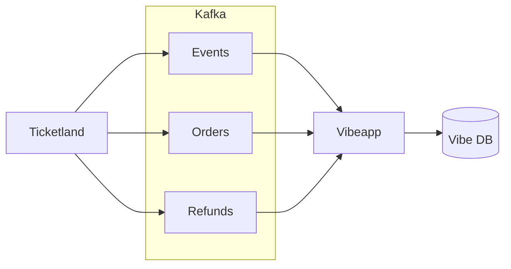

# Vibeapp интеграция

<!--toc:start-->
- [Vibeapp интеграция](#vibeapp-интеграция)
  - [1. Планируемая интеграция с Vibeapp](#1-планируемая-интеграция-с-vibeapp)
  - [2. Формат сообщений в Kafka](#2-формат-сообщений-в-kafka)
  - [3. Подключение к Kafka](#3-подключение-к-kafka)
    - [Production](#production)
    - [Stage/Dev](#stagedev)
  - [4. Текущая интеграция с Ticketscloud](#4-текущая-интеграция-с-ticketscloud)
<!--toc:end-->

## 1. Планируемая интеграция с Vibeapp

Для упрощения интеграции предлагается два варианта передачи данных о билетах и их статусах в Vibeapp.
Формат сообщений — **JSON или Protobuf**, по договорённости между командами.

Vibeapp получает информацию о проданных билетах и их статусах из стрима заказов,
а изменения статусов — из стрима возвратов.

**Топики Kafka:**

- **Мероприятия** —
  [Event JSON](https://github.com/ticketscloud/vibe-integration/blob/main/streams/orders/events.ts)
  (_Должны быть синхронизированы до обработки заказов_)
- **Заказы** —
  [Order JSON](https://github.com/ticketscloud/vibe-integration/blob/main/streams/orders/orders.ts),
- **Возвраты** —
  [Refund JSON](https://github.com/ticketscloud/vibe-integration/blob/main/streams/orders/refunds.ts),

_Набор топиков может быть изменён по согласованию между командами в зависимости от потребностей._

---

## 2. Формат сообщений в Kafka

_Примеры сообщений в формате JSON приведены в соответствующих файлах по ссылкам выше._
Для Protobuf-сообщений схемы также доступны по ссылкам в описании топиков.

Для сообщений обязательно указывать следующие заголовки:

- `content-type`: `application/json` или `application/x-protobuf`
- `schema-version`: версия схемы сообщения (например, `1.0`)
- `application-id`: идентификатор источника данных (например, `ticketland`)

В качестве ключа сообщения рекомендуется использовать уникальный идентификатор сущности (например,
`event_id`, `order_id`).

## 3. Подключение к Kafka

### Production

- **Bootstrap servers**: `rc1a-agdu796r4205p5ip.mdb.yandexcloud.net:9091`
- **Security protocol**: `SASL_SSL`
- **SASL mechanism**: `SCRAM-SHA-512`
- **SSL CA certificate**: `https://storage.yandexcloud.net/cloud-certs/CA.pem`
- **SASL Username**: предоставляется по запросу
- **SASL Password**: предоставляется по запросу

### Stage/Dev

- **Bootstrap servers**: `rc1a-faass3ffar5s5q6o.mdb.yandexcloud.net:9091`
- **Security protocol**: `SASL_SSL`
- **SASL mechanism**: `SCRAM-SHA-512`
- **SSL CA certificate**: `https://storage.yandexcloud.net/cloud-certs/CA.pem`
- **SASL Username**: предоставляется по запросу
- **SASL Password**: предоставляется по запросу

---

## 4. Текущая интеграция с Ticketscloud

В настоящее время Vibeapp получает данные о мероприятиях и билетах из Kafka-стримов Ticketscloud.
Стримы передают информацию об организаторах, мероприятиях, заказах и возвратах билетов.
Формат сообщений — [Protobuf](https://developers.google.com/protocol-buffers).

_Текущие стримы ориентированы на внутренние процессы Ticketscloud и избыточны для внешней интеграции, так как содержат много специализированных полей._

**Kafka-топики:**

- **Организаторы** — данные об организаторах мероприятий
  ([Partner Proto](https://github.com/ticketscloud/vibe-integration/blob/main/ticketscloud/partner.proto))
- **Мероприятия** — события, создаваемые организаторами
  ([Event Proto](https://github.com/ticketscloud/vibe-integration/blob/main/ticketscloud/event.proto))
- **Заказы** — информация о заказах и купленных билетах
  ([Order Proto](https://github.com/ticketscloud/vibe-integration/blob/main/ticketscloud/order.proto))
- **Возвраты** — данные о возвратах билетов
  ([Refund Proto](https://github.com/ticketscloud/vibe-integration/blob/main/ticketscloud/refund_request.proto))

Стрим возвратов используется для актуализации статусов билетов в Vibeapp.
