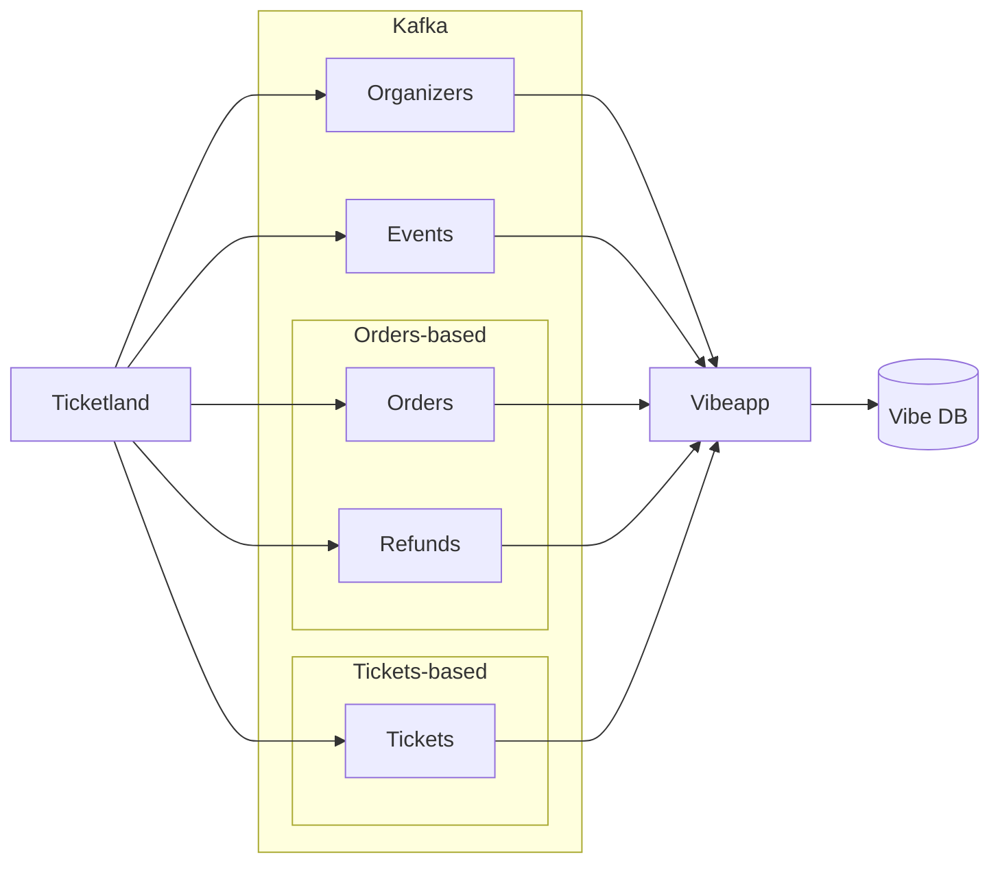

# Vibeapp интеграция

## 1. Текущая интеграция с Ticketscloud

В настоящее время Vibeapp получает данные о мероприятиях и билетах из Kafka-стримов Ticketscloud. Стримы передают информацию об организаторах, мероприятиях, заказах и возвратах билетов. Формат сообщений — [Protobuf](https://developers.google.com/protocol-buffers).

_Текущие стримы ориентированы на внутренние процессы Ticketscloud и избыточны для внешней интеграции, так как содержат много специализированных полей._

**Kafka-топики:**

- **Организаторы** — данные об организаторах мероприятий  
  ([Partner Proto](https://github.com/ticketscloud/vibe-integration/blob/main/ticketscloud/partner.proto))
- **Мероприятия** — события, создаваемые организаторами  
  ([Event Proto](https://github.com/ticketscloud/vibe-integration/blob/main/ticketscloud/event.proto))
- **Заказы** — информация о заказах и купленных билетах  
  ([Order Proto](https://github.com/ticketscloud/vibe-integration/blob/main/ticketscloud/order.proto))
- **Возвраты** — данные о возвратах билетов  
  ([Refund Proto](https://github.com/ticketscloud/vibe-integration/blob/main/ticketscloud/refund_request.proto))

Стрим возвратов используется для актуализации статусов билетов в Vibeapp.

---

## 2. Планируемая интеграция с Vibeapp

Для упрощения интеграции предлагается два варианта передачи данных о билетах и их статусах в Vibeapp. Формат сообщений — **JSON или Protobuf**, по договорённости между командами.

### 2.1. Интеграция через стрим заказов

Вариант, близкий к текущей модели. Vibeapp получает информацию о проданных билетах и их статусах из стрима заказов, а изменения статусов — из стрима возвратов.

**Топики Kafka:**

- **Организаторы** —  
  [Organizer JSON](https://github.com/ticketscloud/vibe-integration/blob/main/streams/orders/organizers.ts),  
  [Organizer Proto](https://github.com/ticketscloud/vibe-integration/blob/main/streams/orders/organizers.proto)  
  _Должны быть синхронизированы до обработки мероприятий и заказов._
- **Мероприятия** —  
  [Event JSON](https://github.com/ticketscloud/vibe-integration/blob/main/streams/orders/events.ts),  
  [Event Proto](https://github.com/ticketscloud/vibe-integration/blob/main/streams/orders/events.proto)  
  _Должны быть синхронизированы до обработки заказов._
- **Заказы** —  
  [Order JSON](https://github.com/ticketscloud/vibe-integration/blob/main/streams/orders/orders.ts),  
  [Order Proto](https://github.com/ticketscloud/vibe-integration/blob/main/streams/orders/orders.proto))
- **Возвраты** —  
  [Refund JSON](https://github.com/ticketscloud/vibe-integration/blob/main/streams/orders/refunds.ts),  
  [Refund Proto](https://github.com/ticketscloud/vibe-integration/blob/main/streams/orders/refunds.proto)

_Набор топиков может быть изменён по согласованию (например, объединение данных организаторов с мероприятиями или заказами)._

---

### 2.2. Интеграция через стрим билетов

Альтернативный вариант — передача **непосредственно билетов** и их текущих статусов (активен, использован, отменён, возвращён).

**Kafka-топики:**

- **Организаторы** —  
  [Organizer JSON](https://github.com/ticketscloud/vibe-integration/blob/main/streams/tickets/organizers.ts),  
  [Organizer Proto](https://github.com/ticketscloud/vibe-integration/blob/main/streams/tickets/organizers.proto)  
  _Должны быть синхронизированы до обработки мероприятий и билетов._
- **Мероприятия** —  
  [Event JSON](https://github.com/ticketscloud/vibe-integration/blob/main/streams/tickets/events.ts),  
  [Event Proto](https://github.com/ticketscloud/vibe-integration/blob/main/streams/tickets/events.proto)  
  _Должны быть синхронизированы до обработки билетов._
- **Билеты** —  
  [Ticket JSON](https://github.com/ticketscloud/vibe-integration/blob/main/streams/tickets/tickets.ts),  
  [Ticket Proto](https://github.com/ticketscloud/vibe-integration/blob/main/streams/tickets/tickets.proto)

_Как и в предыдущем варианте, структура стримов может быть упрощена или объединена по договорённости._
