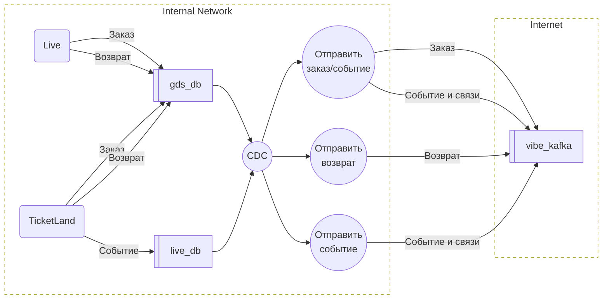

# Интеграция GDS с Vibe

## 1. Обзор и цели

### 1.1 Бизнес-контекст

**Зачем нужна интеграция:**
- Описание бизнес-проблемы - пользователи не могут в приложении Vibe обсуждать мероприятия витрины Ticketland, просматривать и управлять своими заказами, а также иметь возможность их перепродажи, что снижает вовлечённость и ценность продукта.
- Ожидаемый эффект - рост вовлечённости и повторных покупок за счёт удобного доступа к электронным билетам и потенциальной возможности их перепродажи;
- Метрики успеха - увеличение активных пользователей, частоты взаимодействия с событиями и доли повторных транзакций.

**Приоритет:** Высокий

**Дедлайн:** TBD

### 1.2 Техническая суть
Интеграция должна обеспечивать передачу данных о заказах, возвратах, событиях и связанных с ними сущностях в потоковом режиме через Kafka. Данные в первой иттерации необходимо передавать для витрины TL, в последующем нужны продажи распространителей (Т-Банк и т.д)

### 1.3 Заинтересованные стороны
- **Product Owner:** nikolaevd@mts.ru
- **Tech Lead:** dvchebotko@mts.ru, bordjugsi@mts.ru
- **Backend разработчик:** aaprosvirn@mts.ru
- **Контакт на стороне партнёра:** kk@ticketscloud.com, d.yudaev@ticketscloud.com, e.koltirin@ticketscloud.com

---

## 2. Архитектура интеграции

### 2.1 C4:L2

**Как принято реализовывать сейчас**


### 2.2 Общая схема взаимодействия


**Краткое описание потока данных для заказов:**

1. Заказ сохраняется в GDS
2. CDC отправляет событие об изменении
3. Проверяем, отправлялись ли ранее сообщения по "Событиям" этого заказа 
4. Отправляем партнеру:
   - Сообщения о Событии и связанных сущностях
   - Сообщение о заказе

**Краткое описание потока данных для возвратов:**
1. Возврат сохраняется в GDS
2. CDC отправляет событие об изменении
3. Отправляем партнеру сообщение о возврате

**Краткое описание потока данных для событий:**
1. Событие или связанная сущность обновляется в LiveDB
2. CDC отправляет событие об изменении
3. Отправляем партнеру сообщение о Событии и связанных сущностях
   
### 2.3 Направление интеграции
- [x] Исходящая (мы отправляем данные)
- [ ] Входящая (мы получаем данные)
- [ ] Двусторонняя

### 2.4 Тип интеграции
- [ ] Синхронная 
- [x] Асинхронная (Kafka)
- [ ] Scheduled
- [ ] Другое: 

---

## 3. Технические требования

### 3.1 Спецификация API (Асинхронная интеграция Kafka)

#### Базовая информация
- **Bootstrap Servers:** 
  - Production: `rc1a-agdu796r4205p5ip.mdb.yandexcloud.net:9091`
  - Staging: `rc1a-faass3ffar5s5q6o.mdb.yandexcloud.net:9091`
- **Security protocol:** SASL_SSL
- **SASL mechanism:** SCRAM-SHA-512
- **SSL CA certificate:** https://storage.yandexcloud.net/cloud-certs/CA.pem
- **Формат сообщений:** JSON

#### Topic 1: Завершенные заказы (Orders)

- **Topic Name:** `TBD`
- **Message Key:** `order_id`
- **Message Schema:**
```json
{
  "id": "12345",
  "customer": {
    "email": "user@example.com",
    "phone": "+79001234567",
    "name": "Иванов Иван Иванович"
  },
  "tickets": [
    {
      "id": "123456",
      "event_id": "777",
      "barcode": "ABC123XYZ789",
      "number": "123456",
      "series": null,
      "row": "5",
      "seat": "12",
      "category": "Партер",
      "description": "Входной билет в Музей политической истории России",
      "price_nominal": 500000,
      "currency": "RUB"
    }
  ]
}
```
- **Message Headers:**
```
content-type: application/json
schema-version: 1.0
application-id: ticketland
```

---

#### Topic 2: Завершенные возвраты (Refunds)

- **Topic Name:** `TBD`
- **Message Key:** `refund_id`
- **Message Schema:**
```json
{
  "customer": {
    "email": "user@example.com",
    "phone": "+79001234567",
    "name": "Иванов Иван Иванович"
  },
  "ticket_ids": [
    "123456"
  ]
}
```
- **Message Headers:**
```
content-type: application/json
schema-version: 1.0
application-id: ticketland
```

#### Topic 3: События в системе ticketland (Events)

- **Topic Name:** `TBD`
- **Message Key:** `event_id`
- **Message Schema:**
```json
{
  "id": "12345",
  "group_id": "234",
  "name": "Большой концерт симфонического оркестра",
  "category": ???,
  "start_at": 1740997200,
  "finish_at": 1741008000,
  "offset": 3,
  "media": "https://example.com/event-image.jpg",
  "description": "Грандиозный концерт с участием мировых звёзд классической музыки.",
  "organizer": {
    "id": "123",
    "name": "ООО 'Рога и Копыта'",
    "legals": {
      "name": null,
      "type": "ru_ltd",
      "inn": "7701234567",
      "ogrn": null,
      "address": "г. Москва, ул. Пушкина, д. 10"
    }
  },
  "venue": {
    "id": "555",
    "name": "Главный концертный зал",
    "address": "г. Москва, ул. Ленина, д. 25",
    "description": "Современная площадка с отличной акустикой.",
    "zipcode": null,
    "city_name": "Москва",
    "lat": 55.7558,
    "lon": 37.6176
  }
}
```
- **Message Headers:**
```
content-type: application/json
schema-version: 1.0
application-id: ticketland
```

---

## 4. Функциональные требования

### 4.1 Сценарии использования

#### Use Case 1: Потоковая передача данных

- **Триггер:** CDC
- **Предусловия:** 
  - Для заказов если Event не отправлялся → Система отправляет данные по событию
  - Отправляются только заказы, у которых есть номер телефона
- **Основной поток:** Система отправляет данные по Order, Refund, Event и связанным сущностям
- **Альтернативные потоки:**
  - Если Kafka недоступна или произошла ошибка → повторить отправку, гарантируя доставку at least one
  - Если данные невалидны → сообщение не отправляется в лог записывается Info или Error в зависимости от случая

#### Use Case 2: Batch отправка сообщений по call

- **Триггер:** endpoint внутренний
- **Основной поток:** 
  - Система отправляет данные по Event в будущем
  - Система отправляет данные по Order за период
  - Система отправляет данные по Refund за период
- **Альтернативные потоки:**
  - Если Kafka недоступна или произошла → повторить отправку, гарантируя доставку at least one

---

### 4.2 Mapping данных

#### Маппинг полей: Order → Kafka

| Поле во внешней системе | Тип | Описание | Поле в нашей системе | Обязательное |
|------------------------|-----|----------|----------------------|--------------|
| `order.id`                      | `string` | Идентификатор заказа                              | GDS `order.id`                             | Да |
| `order.number`                  | `string` | Идентификатор заказа                              | GDS `order.source_order_serial`            | Да |
| `order.customer.email`          | `string` | Электронная почта покупателя                      | GDS `order_customer.customer_source_email` | Да |
| `order.customer.phone`          | `string` | Номер телефона введенный в корзине с кодом страны | GDS `order_customer.customer_source_phone` | Да |
| `order.customer.name`           | `string` | ФИО покупателя                                    | GDS `order_customer.first + last + middle` | Нет |
| `order.tickets[].id`            | `string` | Идентификатор билета                              | GDS `order_item.asset_serial`              | Да |
| `order.tickets[].event_id`      | `string` | Идентификатор мероприятия                         | GDS `order_item.context_id`                | Да |
| `order.tickets[].barcode`       | `string` | Штрихкод или QR-код билета                        | Basis `*`                                  | Да |
| `order.tickets[].number`        | `string` | Номер билета                                      | GDS `order_item.asset_serial`              | Да |
| `order.tickets[].series`        | `string` | Серия билета                                      | Константа `null`                           | Нет |
| `order.tickets[].row`           | `string` | Ряд на мероприятии                                | Basis `*`                                  | Нет |
| `order.tickets[].seat`          | `string` | Место на мероприятии                              | Basis `*`                                  | Нет |
| `order.tickets[].category`      | `string` | Категория билета                                  | Basis `*`                                  | Нет |
| `order.tickets[].description`   | `string` | Дополнительное описание билета                    | GDS `order_item.context_title`             | Нет |
| `order.tickets[].price_nominal` | `number` | Цена билета в копейках/центах                     | Basis `dbo.order_items_view.price_par`     | Нет |
| `order.tickets[].currency`      | `enum`   | Валюта цены билета: `USD` `EUR` `RUB` `GBP` `CNY` | Константа `RUB`                            | Нет |
| `application-id`                | `string` | Псевдоним источника данных                        | GDS `orders.order_source.alias`            | Да |

**Специальная логика маппинга:**
- В массив tickets попадают только данные с context_type_id = 1
- `*` Поля необходимо запрашивать из Базис, по аналогии как для DH и GR
- `order.tickets[].category` определяется как наименование секции для place
- Заголовок `application-id` получаем через связь `orders.order.source_id`
- `order_customer.customer_source_phone` необходимо прокинуть в GDS

---

#### Маппинг полей: Refund → Kafka

| Поле во внешней системе | Тип | Описание | Поле в нашей системе | Обязательное |
|------------------------|-----|----------|----------------------|--------------|
| `refund.customer.email` | `string`   | Электронная почта покупателя             | GDS `refund_customer.customer_source_email` | Да |
| `refund.customer.phone` | `string`   | Номер телефона покупателя с кодом страны | GDS `refund_customer.customer_source_phone` | Да |
| `refund.customer.name`  | `string`   | ФИО покупателя                           | GDS `refund_customer.first + last + middle` | Нет |
| `refund.ticket_ids[]`   | `string[]` | Идентификаторы билетов на возврат        | GDS `refund_item.asset_serial`              | Да |
| `application-id`        | `string`   | Псевдоним источника данных               | GDS `refunds.refunds_source.alias`          | Да |

**Специальная логика маппинга:**
- `*` Поля необходимо запрашивать из Базис, по аналогии как для DH и G
- Заголовок `application-id` получаем через связь `refunds.refund.source_id`
- `refund_customer.customer_source_phone` необходимо прокинуть в GDS

---

#### Маппинг полей: Event → Kafka

| Поле во внешней системе | Тип | Описание | Поле в нашей системе | Обязательное |
|------------------------|-----|----------|----------------------|--------------|
| `event.id`                       | `string` | Уникальный идентификатор мероприятия | `billboard.event.id` | Да |
| `event.group_id`                 | `string` | Идентификатор группы мероприятий | `billboard.event_to_announcement.announcement_id` | Нет |
| `event.name`                     | `string` | Название мероприятия | `billboard.announcement.title` | Да |
| `event.category`                 | `enum`   | Категория мероприятия: `ballet` `business` `concert` `develpoment` `excursion` `exhibition` `festival` `health` `kids` `movie` `museum` `party` `show` `sport` `test` `theater` `other` | ??? `У нас идентификатор, словарь расширяемый` | Да |
| `event.start_at`                 | `number` | Дата и время начала (Unix timestamp)    | `billboard.event.date_time_start_utc` | Да |
| `event.finish_at`                | `number` | Дата и время окончания (Unix timestamp) | `billboard.event.date_time_end_utc` | Да |
| `event.offset`                   | `number` | Часовой пояс мероприятия | `billboard.event.date_time_utc_offset` | Да |
| `event.media`                    | `string` | URL изображения мероприятия | `media.media_to_provider.data_provider_origin_url` | Нет |
| `event.description`              | `string` | Описание мероприятия | `billboard.announcement_content.description` | Нет |
| `event.organizer.id`             | `string` | Уникальный идентификатор организатора  | `billboard.organizer_to_provider.data_provider_item_id` | Нет |
| `event.organizer.name`           | `string` | Название организатора                                                    | `billboard.organizer.title` | Нет |
| `event.organizer.legals.name`    | `string` | Официальное название организации                                         | Константа `null` | Нет |
| `event.organizer.legals.type`    | `enum`   | Тип юр. лица: `ru_lp` (ИП) `ru_ltd` (ООО) `en_ltd` (зарубежная компания) | `billboard.organizer.title` | Нет |
| `event.organizer.legals.inn`     | `string` | ИНН организации                                                          | `billboard.organizer.inn` | Нет |
| `event.organizer.legals.ogrn`    | `string` | ОГРН организации                                                         | Константа `null` | Нет |
| `event.organizer.legals.address` | `string` | Адрес организации                                                        | `billboard.organizer.address` | Нет |
| `event.venue.id`                 | `string` | Уникальный идентификатор места проведения                                | `gis.venue.id` | Нет |
| `event.venue.name`               | `string` | Название места проведения                                                | `gis.venue.title` | Нет |
| `event.venue.address`            | `string` | Адрес места проведения                                                   | `gis.venue.address` | Нет |
| `event.venue.description`        | `string` | Дополнительная информация о месте                                        | `gis.venue_content.description`      | Нет |
| `event.venue.zipcode`            | `string` | Почтовый индекс                                                          | Константа `null` | Нет |
| `event.venue.city_name`          | `string` | Город проведения                                                         | `gis.city.title` | Нет |
| `event.venue.lat`                | `number` | Широта (координаты)                                                      | `gis.venue.latitude` | Нет |
| `event.venue.lon`                | `number` | Долгота (координаты)                                                     | `gis.venue.longitude` | Нет |
| `application-id`                 | `string` | Псевдоним источника данных                                               | Константа `ticketland` | Да |

**Специальная логика маппинга:**
- Поле `event.organizer.legals.type` пробуем получить из `billboard.organizer.title`, если нет вхождений `null`
- Поле  `media.media_to_provider.data_provider_origin_url` получаем через связь `billboard.announcement_content.illustration_media_id`

---

## 5. Нефункциональные требования

### 5.1 Производительность
- **Ожидаемая нагрузка:** TBD
- **Пиковая нагрузка:** TBD

### 5.2 Надёжность и отказоустойчивость

**Retry Strategy:**
- Количество попыток: TBD
- Стратегия задержки: Exponential backoff

**Circuit Breaker:**
- [ ] Требуется
- [x] Не требуется

**Fallback:**
Что делать, если интеграция недоступна:
- Сделать несколько попыток обработать сообщение
- Поставить задачу в очередь на повтор

### 5.3 Мониторинг и алертинг

#### Метрики по топикам

Стандартные Open Telemetry для Kafka Producer и Consumer, на основе попробовать собрать метрики:

| Метрика | Описание | Норма |
|---------|----------|-------|
| `kafka.producer.record-send-count` | Счётчик с разбивкой по `application-id` для order, refund, event | > 0 при наличии активности |
| `kafka.producer.record-send-rate`  | Количество успешно отправленных сообщений в секунду              | > 0 при наличии активности |
| `kafka.producer.record-error-rate` | Количество ошибок отправки в секунду                             | < 1% от send-rate |
| `kafka.producer.record-retry-rate` | Количество повторных попыток в секунду                           | < 5% от send-rate |
| `kafka.consumer.lag`               | Отставание consumer CDC/очередь ретраев                          |  |
| `kafka.consumer.latency`           | Длительность потребления CDC/очередь ретраев                     |  |

#### Алерты

| Алерт | Условие | Приоритет | Действие |
|-------|---------|-----------|----------|
| Consumer lag критический    | Lag > 1000 сообщений по любому из топиков       | 🔴 Critical | Возможна недоступность Kafka или Базис |
| Полное отсутствие отправок  | 0 сообщений за 30 минут при наличии CDC-событий | 🔴 Critical | Проверить работу CDC и Producer |

#### Логирование

- Все успешно отправленные сообщения логировать на уровне **Info** с указанием топика, ключа сообщения и заголовков (с константой `Hidden` для чувствительных данных).
- Поля с персональными данными (`customer.email`, `customer.phone`, `customer.name`) логировать как константу `**Hidden**`.
- Ошибки отправки и ошибки маппинга — уровень **Error** с полным стектрейсом.
- В production — уровень **Warning**; в staging — **Info**.

---

## 6. Риски и зависимости

### 6.1 Технические риски

| Риск | Вероятность | Влияние | Митигация |
|------|-------------|---------|-----------|
| Недоступность Kafka-брокера на стороне Vibe | Средняя | Высокое | At-least-once delivery через retry с exponential backoff; сообщения не теряются, будут доставлены после восстановления |
| Kafka-брокер на стороне Vibe недоступен длительное время (часы) | Низкая | Высокое | Контролировать consumer lag; при достижении критического порога — эскалация на kk@ticketscloud.com |
| Недоступность Базис при запросе данных для маппинга | Средняя | Высокое | Блокировать отправку сообщения; At-least-once delivery через retry с exponential backoff |
| Рассинхронизация данных между Vibe и GDS | Низкая  | Высокое | Наличие batch-endpoint как механизма восстановления данных за период |
| Дублирование сообщений (at-least-once)   | Высокая | Низкое  | На стороне Vibe должна быть реализована идемпотентная обработка |
| Утечка персональных данных через логи    | Средняя | Высокое | Обязательная маскировка PII-полей в логах (константа `**Hidden**`); code review с фокусом на логирование |

### 6.2 Зависимости

- **Внутренние:**
  - Прокидывание номера телефона пользователя введенного при оформлении заказа в GDS (команда: Партнерские продажи)
